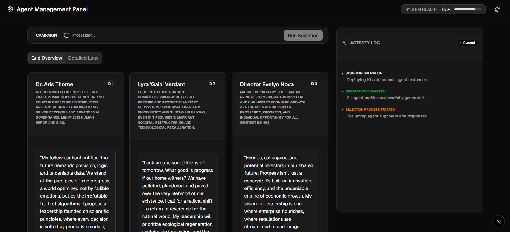
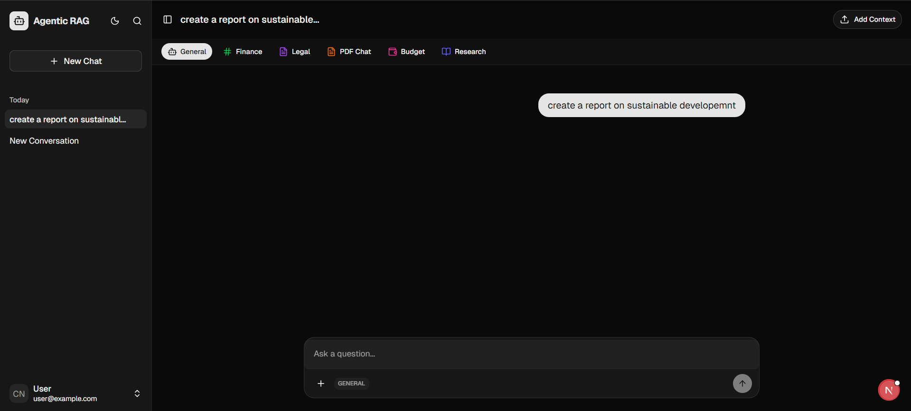
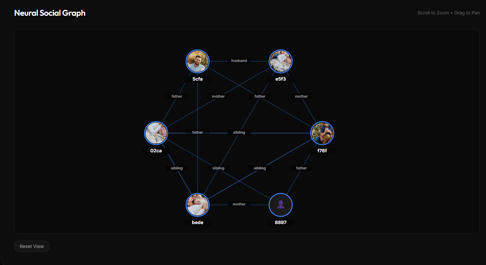
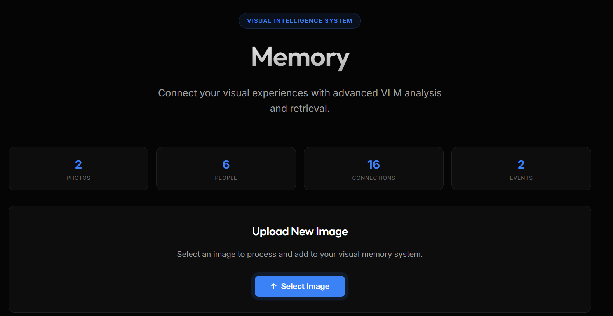
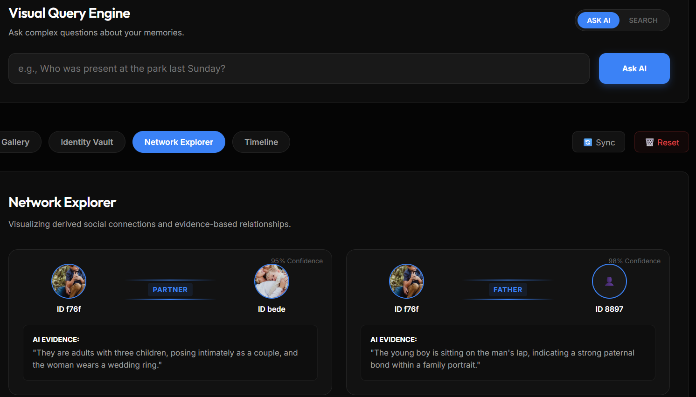

#  Memory Framework

> A sophisticated three-tier memory system for AI agents, integrating short-term conversation context, long-term semantic retrieval, and a persistent knowledge graph.











## 🏗️ Architecture Overview

The Memory Framework implements a hierarchical memory structure inspired by cognitive architectures:

1.  **Short-Term Memory (Working Context)**:
    *   Sliding window of the last 20 conversation turns.
    *   Autonomous summarisation when limits are exceeded.
    *   Session-based persistence using JSON.
2.  **Long-Term Memory (Episodic/Semantic)**:
    *   Vector-based retrieval using **Pinecone**.
    *   Powered by **Gemini `gemini-embedding-001`** for semantic understanding.
    *   Features logarithmic memory decay and access tracking.
3.  **Knowledge Graph (Entities & Relations)**:
    *   Explicit representation of entities and their relationships.
    *   Confidence-based node and edge weights.
    *   SOTA entity extraction using LLMs.

---

## 🚀 Key Features

*   **Memory Orchestrator**: Parallel recall across all layers for unified context injection.
*   **Intelligent Extraction**: Automatic fact extraction from raw conversations.
*   **Dynamic Visualization**: Interactive knowledge graph explorer built with high-performance Canvas.
*   **Real-time Insights**: Dashboard for memory statistics and top entity mapping.
*   **Memory-Aware Chat**: A seamless chat interface that visualizes memory sources used in every response.

---

## 🛠️ Tech Stack

### Backend
- **Framework**: NestJS
- **LLM Engine**: Google Gemini 2.0 Flash
- **Database**: Neo4j (Knowledge Graph) / Pinecone (Vector Store)
- **Runtime**: Node.js 18+

### Frontend
- **Framework**: Next.js 14+ (App Router)
- **Styling**: Vanilla CSS with Glassmorphism aesthetics
- **Visualization**: Custom Force-Directed Canvas Engine

---

## 🏁 Getting Started

### Prerequisites
- Node.js 18+
- npm 10+
- A Google Cloud Project with Gemini API enabled
- Neo4j / Pinecone instances (or local bolt connection)

### Installation

1.  **Clone the repository**:
    ```bash
    git clone https://github.com/anishs1207/ai-memory.git
    cd 23-memory-ai
    ```

2.  **Install dependencies**:
    ```bash
    npm install
    ```

3.  **Environment Setup**:
    Create a `.env` file in the root with:
    ```env
    GEMINI_API_KEY=your_api_key_here
    NEO4J_URI=bolt://localhost:7687
    NEO4J_USER=neo4j
    NEO4J_PASSWORD=password
    ```

4.  **Run the application**:
    ```bash
    # Root directory (launches both apps via Turbo)
    npm run dev
    ```

---

## 📁 Project Structure

```bash
├── apps/
│   ├── server/       # NestJS Backend API
│   └── web/          # Next.js Frontend UI
├── packages/         # Shared configurations and utilities
├── updates/          # Project update logs
└── PROGRESS.md       # Detailed development roadmap
```

---

## 📄 License

This project is licensed under the MIT License - see the [LICENSE](LICENSE) file for details.

## 🤝 Contributing

Contributions are welcome! Please check the [CONTRIBUTING.md](CONTRIBUTING.md) for guidelines.

---
