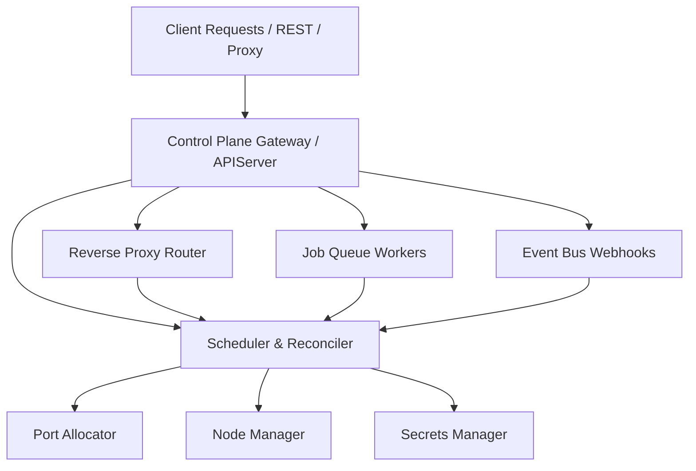

# AgentOS Orchestrator Engine Architecture

Date: 2026-06-26

AgentOS is a production-grade, lightweight, Kubernetes-like orchestrator for AI agents written in Go. It manages the lifecycles of agents running in sandboxed subprocesses, exposes REST APIs for configuration and workflow execution, reverse-proxies and load-balances client traffic, implements scale-to-zero autoscaling, isolates tenant billing, and runs background jobs and event-driven webhooks.

---

## Directory Structure

All files reside inside the `apps/agent-infra` directory under the package `orchestrator`:

* **`main.go`**: The entrypoint of the orchestrator, initializing all subsystems, launching background monitors, configuring CORS middleware, and starting the HTTP server on port `8080`.
* **`orchestrator/`**: Core library files:
  * **`manifest.go`**: Defines the `AgentManifest` configuration schema mapped from `agent.yaml`, placement constraints, autoscaling policies, and canary specifications.
  * **`process.go`**: Manages the life cycle of agent replica instances using OS-specific subprocess commands (`cmd` on Windows, `/bin/sh` on Unix) and implements a thread-safe `PortAllocator`.
  * **`node.go`**: Models cluster compute hardware and handles least-load scheduling placement.
  * **`scheduler.go`**: Reconciles actual running replicas against desired counts, handles scale-to-zero checking, and executes horizontal autoscaling.
  * **`proxy.go`**: A reverse proxy routing traffic under `/proxy/:agent_name/*` with round-robin load-balancing and canary percentage matching.
  * **`secret.go`**: A thread-safe, namespace-isolated secret storage engine.
  * **`state.go`**: Probes host ports for Redis and PostgreSQL, falling back to safe in-memory key-value state persistence.
  * **`queue.go`**: Background job worker threads polling an internal buffered channel for asynchronous tasks.
  * **`eventbus.go`**: Event pub/sub coordinator forwarding payloads via webhooks to subscriber agents.
  * **`workflow.go`**: Evaluates multi-agent pipelines with data interpolation templates.
  * **`server.go`**: Implements HTTP REST handlers for the orchestrator control plane APIs.

---

## Component Subsystems

### 1. Reverse Proxy & Gateway Router (`proxy.go`)
* Serves routes at `/proxy/:agent_name/*`.
* Validates tenant isolation using headers: `X-Tenant-ID`, `X-Workspace-ID`, `X-Organization-ID`.
* Intercepts requests for scaled-to-zero agents and blocks execution, calling `Scheduler.EnsureActive()` to wake the agent before forwarding.
* Performs round-robin selection among healthy instances matching the target deployment version.
* Implements **Canary Deployments** by evaluating `CanaryPolicy.Weight` against a timestamp-based dice roll, routing a percentage of traffic to the canary version.

### 2. Scheduler & Port Pool (`scheduler.go`, `process.go`)
* Runs a periodic reconciler loop checking deployment status.
* Reserves a port range (`10000` to `11000`). **Port Allocator** validates that ports are physically free at the OS level using local TCP port binding checks before allocating them to replicas.
* **Scale-To-Zero Monitor**: Periodically scans deployments. If an agent with `minReplicas: 0` receives no traffic for its specified `idleTimeout` duration, desired replicas are set to `0` and actual instances are shut down.
* **Autoscaler**: A background loop monitoring telemetry metrics (CPU, Memory, RPS, Token rate, or Job Queue Depth) and recalculating desired replica counts.

### 3. Node Fleet Management (`node.go`)
* Manages a collection of virtual cluster nodes (`node-a`, `node-b`, `node-c`) representing available GPUs, memory, and baseline loads.
* Filters scheduling locations based on region constraints, GPU requests, and memory requirements.
* Implements **Node Statuses** (`ACTIVE`, `DRAINING`, `OFFLINE`). When a node is marked as `DRAINING`, the Scheduler evicts and stops all running replicas on it, rescheduling them onto other healthy nodes.

### 4. Asynchronous Jobs & Workflows (`queue.go`, `workflow.go`)
* **Job Queue**: A worker pool of concurrent goroutines picking up task IDs from a buffered channel. Runs HTTP POST/GET invocations to `/invoke` on backing replicas.
* **Workflow Engine**: Coordinates sequential execution of multi-agent blueprints (pipelines). Supports JSON parameter interpolation using brackets:
  * `{{input.field}}` parses inputs sent to the pipeline.
  * `{{steps.stepname.output.field}}` parses results returned by previous steps.

### 5. Shared Event Bus (`eventbus.go`)
* Allows agents to publish events to specific topics asynchronously.
* Dispatches event JSON payloads via webhooks to registered subscriber agents, ensuring the target agents are active/booted before forwarding.

---

## Control Plane REST APIs

### Deployments & Scaling
* `POST /api/deploy`: Body `{"path": "./path/to/agent.yaml"}`
* `DELETE /api/deploy/{name}`: Undeploys the agent.
* `POST /api/agents/{name}/scale`: Body `{"replicas": N}`
* `GET /api/agents`: Lists all current deployments.
* `GET /api/agents/{name}/logs`: Consolidated logs of stdout/stderr.

### Node Management
* `GET /api/nodes`: List cluster nodes.
* `POST /api/nodes/{id}/status`: Body `{"status": "ACTIVE" | "DRAINING" | "OFFLINE"}`. Updates node status and evicts replicas if draining.

### Job & Workflows
* `POST /api/agents/{name}/jobs`: Enqueues an async task.
* `GET /api/jobs/{id}`: Polls task state.
* `POST /api/workflows`: Registers a workflow pipeline blueprint.
* `POST /api/workflows/{name}/execute`: Executes a pipeline execution sequence.

### Secrets & State Store
* `POST /api/secrets`: Set API credentials.
* `POST /api/state/{agent}/{key}`: Store state persistent values.
